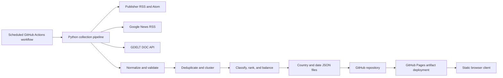

# Worldline

Worldline is a lightweight global headline reader designed for GitHub Pages. It provides a country-based news edition and an honest seven-day archive without requiring a traditional server, database, user account, or browser requests to publisher feeds.

The United States is the default and first market. The interface uses American English, 12-hour time, `Today` and `Yesterday`, and each selected country's local time zone.

The repository includes clearly labeled sample preview data. The first successful `Update News Data` workflow replaces the sample files with generated live metadata. Sample files are never used as a silent fallback after live generation.

## Main features

- Fourteen configured markets, ordered from the United States through Qatar
- Exactly seven date controls for every market, even when a date has no articles
- Separate static JSON file for each country and local calendar date
- RSS, Atom, Google News RSS, and GDELT collection
- Time-zone-aware daily boundaries, including daylight-saving transitions
- URL normalization and tracking-parameter removal
- Exact and conservative near-duplicate removal
- Related-coverage event clustering
- Configurable ranking and source concentration limits
- Honest current, partial, retained, empty, and failed states
- Optional build-time English translation through DeepL
- Direct links to original publisher or provider URLs
- Relative paths that work on both user and project GitHub Pages sites
- Responsive layouts for mobile, tablet, laptop, and desktop
- Keyboard navigation, semantic HTML, visible focus, and reduced-motion support

## Architecture



The browser loads `data/manifest.json` first, then loads only the selected country and date file. Publisher feeds and external APIs are contacted only by the scheduled workflow.

## Repository structure

```text
/
  index.html
  about.html
  404.html
  assets/
    css/styles.css
    js/app.js
    icons/
  config/
    countries.json
    settings.json
    ranking.json
    sources.json
  data/
    manifest.json
    source-health.json
    http-cache.json
    translation-cache.json
    US/YYYY-MM-DD.json
    ...
  scripts/
    aggregate_news.py
    feed_parser.py
    gdelt_client.py
    google_news_client.py
    normalize.py
    deduplicate.py
    cluster.py
    classify.py
    rank.py
    translate.py
    validate_output.py
    utilities.py
  tests/
  .github/workflows/
    update-news.yml
    deploy-pages.yml
```

## Local development

### 1. Create a virtual environment

```bash
python -m venv .venv
```

Activate it:

```bash
# Windows PowerShell
.venv\Scripts\Activate.ps1

# macOS or Linux
source .venv/bin/activate
```

### 2. Install dependencies

```bash
python -m pip install --upgrade pip
python -m pip install -r requirements.txt
```

### 3. Preview the included sample data

Run a local static server from the repository root:

```bash
python -m http.server 8000
```

Open `http://localhost:8000/`.

Do not open `index.html` directly with a `file:` URL. Browser security rules can block the JSON requests.

### 4. Run tests

```bash
python -m pytest -q
```

### 5. Run live aggregation manually

```bash
python -m scripts.aggregate_news
python -m scripts.validate_output
```

To test only selected countries:

```bash
python -m scripts.aggregate_news --countries US,GB
```

A partial-country run retains the other countries already listed in the manifest. The scheduled workflow performs a full run.

## Data generation and retention

For every country, the collector:

1. Calculates the current date and six previous dates in the configured IANA time zone.
2. Fetches configured publisher feeds once and assigns entries to their local dates.
3. Queries Google News RSS and GDELT separately for each local calendar date.
4. Validates headlines, URLs, publishers, and publication times.
5. Merges new results with existing valid daily data.
6. Removes exact and conservative near duplicates.
7. Groups related reporting from different publishers.
8. Applies conservative category rules.
9. Optionally translates non-English headlines at build time.
10. Ranks and balances representative stories.
11. Compares the new result with the previous valid file.
12. Retains the previous file when a new result is empty or suspiciously small.
13. Deletes files outside the configured archive only after generation succeeds.

`data/manifest.json` is authoritative. Browser local storage is only a small navigation cache and never serves as the historical source of truth.

## Status behavior

- `current`: the latest collection produced a valid daily archive.
- `partial`: a valid archive was produced, but one or more sources failed.
- `retained`: the latest attempt was unsafe or incomplete, so the previous valid file was preserved.
- `empty`: no valid articles were retrieved for that date.
- `failed` or `missing`: the generated file is invalid or unavailable.
- `sample`: clearly labeled preview data that exists before the first live workflow run.

The frontend always shows all seven date controls. It never removes a date simply because the date contains zero articles.

## Configuration

### Add a country

Edit `config/countries.json` and add an object containing:

- `code`
- `name`
- `order`
- `flag`
- `timeZone`
- Google News locale, country, and language values
- `primaryLanguage`
- `gdeltSourceCountry`
- country-name aliases used for conservative domestic relevance
- a `sources` list with source ID, name, feed URL, homepage, language, and quality weight

Then run:

```bash
python -m pytest -q
python -m scripts.aggregate_news
python -m scripts.validate_output
```

### Reorder countries

Change each country's numeric `order` value in `config/countries.json`. Rendering logic sorts that configuration and does not contain a hard-coded country order.

### Add, remove, or disable a publisher feed

Edit the selected country's `sources` list in `config/countries.json`.

To disable a feed without deleting it:

```json
{
  "id": "publisher-feed",
  "name": "Publisher",
  "url": "https://publisher.example/feed.xml",
  "homepage": "https://publisher.example/",
  "language": "en",
  "qualityWeight": 1.0,
  "enabled": false
}
```

Source URLs can change. A failed source remains visible in source-health metadata and does not stop the other sources from processing.

### Change archive length

Change `archiveDays` in `config/settings.json`. The requested product behavior is seven days, and the frontend intentionally renders seven controls. Changing this value also requires updating the frontend's `getSevenDateKeys` length and its corresponding tests.

### Change per-day limits and safeguards

Edit these values in `config/settings.json`:

- `perDayTarget`
- `maxArticleCountPerDay`
- `minimumSafeArticleCount`
- `suspiciousDropRatio`
- request timeout, response-size, concurrency, and retry settings

### Change ranking and source balance

Edit `config/ranking.json`. The scoring weights cover independent coverage, recency, configured source quality, useful source metadata, domestic relevance, and provider penalties.

The balancing settings control the first-results window, per-publisher limit, desired publisher diversity, and aggregator-only limit. Ranking is an automated presentation aid, not an objective measure of importance.

### Change the collection schedule

Edit `.github/workflows/update-news.yml`:

```yaml
on:
  schedule:
    - cron: "17 */2 * * *"
```

GitHub cron schedules use UTC. The non-round minute reduces competition with workflows commonly scheduled at the top of the hour.

## GitHub deployment

### Create the repository

For a project site, use any repository name, such as `headlines`. The site address will be similar to:

```text
https://USERNAME.github.io/headlines/
```

For a user site, name the repository exactly:

```text
USERNAME.github.io
```

The site address will be:

```text
https://USERNAME.github.io/
```

Push the complete repository to the default `main` branch.

### Enable workflow write permission

The update workflow commits generated JSON back to the repository.

1. Open the repository on GitHub.
2. Select `Settings`.
3. Select `Actions`, then `General`.
4. Scroll to `Workflow permissions`.
5. Select `Read and write permissions`.
6. Save the change.

The workflow itself requests only `contents: write`.

### Enable GitHub Pages

1. Open `Settings`.
2. Select `Pages` under `Code and automation`.
3. Under `Build and deployment`, set `Source` to `GitHub Actions`.
4. Return to the `Actions` tab.
5. Open `Deploy GitHub Pages` and choose `Run workflow` for the initial deployment.

The deployment workflow uses GitHub's official Pages actions and publishes only `index.html`, `about.html`, `404.html`, `.nojekyll`, `assets`, `config`, and `data`.

### Run the first live collection

1. Open the repository's `Actions` tab.
2. Select `Update News Data`.
3. Select `Run workflow`.
4. Wait for tests, generation, validation, and the data commit to complete.
5. The `Deploy GitHub Pages` workflow runs after the update workflow completes successfully.

The update workflow also runs automatically every two hours.

### Base-path support

No JavaScript build step or base-path setting is required. HTML assets use document-relative paths, and JavaScript resolves data paths against `document.baseURI`. This works for both:

```text
https://USERNAME.github.io/
https://USERNAME.github.io/headlines/
```

Do not change the asset references to root-relative paths such as `/assets/styles.css` or `/data/manifest.json`.

Shareable views use query parameters:

```text
?country=US&date=2026-07-19&category=technology
```

The app validates country, date, and category parameters, preserves Back and Forward navigation, and falls back to the United States and the selected market's current local date.

### Canonical URL and social metadata

After deployment, replace the relative canonical URL and the JSON-LD `url` in `index.html` with the final public site URL. You may also replace `assets/icons/social-preview.svg` with a PNG if a social platform does not accept SVG preview images.

## Optional English translation

Translation is disabled by default and is never required for deployment.

The included adapter supports DeepL at build time:

1. Create a DeepL API account and review the provider's current quota, pricing, and supported languages.
2. In the GitHub repository, open `Settings`, then `Secrets and variables`, then `Actions`.
3. Under `Secrets`, create `DEEPL_API_KEY` with the API key.
4. Under `Variables`, create `TRANSLATION_PROVIDER` with value `deepl`.
5. For a DeepL Pro account, create `DEEPL_API_URL` with the provider's Pro endpoint. The workflow defaults to the Free API endpoint.
6. Run `Update News Data` manually.

The key is read only by GitHub Actions. It is not written to frontend code, generated JSON, caches, or logs. Translations are cached by stable article and title identifiers in `data/translation-cache.json` so unchanged headlines are not repeatedly translated.

To disable translation, delete the `TRANSLATION_PROVIDER` variable or set it to `none`. Original-language headlines remain available regardless of translation status.

## Source health

Each feed attempt records:

- source ID and display name
- success or failure
- attempt and success timestamps
- article count
- response time
- compact error type and message

The frontend presents a short visitor-friendly summary. Detailed execution logs remain in GitHub Actions.

## Security controls

- Feed content is treated as untrusted.
- Only HTTP and HTTPS article URLs are accepted.
- Localhost and unsafe URL schemes are rejected.
- Tracking query parameters are removed from canonical URLs.
- Summaries are stripped to plain text.
- Generated files are validated before commit.
- Responses have timeout and size limits.
- External links use `noopener noreferrer`.
- The browser uses text nodes instead of injecting feed HTML.
- API keys remain in Actions secrets.
- Dependencies and Actions major versions are pinned.
- A restrictive Content Security Policy is included where practical for GitHub Pages.

## Copyright and attribution

Worldline is a headline aggregator, not a publisher-content mirror. It stores limited feed metadata and does not fetch or reproduce full article bodies. It does not bypass paywalls. Headlines and publisher-provided images remain the property of their respective publishers.

Publishers can request source removal by opening a repository issue that identifies the applicable source entry.

## Known limitations

- Publishers may change, restrict, or discontinue feeds without notice.
- Some sources omit images, descriptions, precise timestamps, or language metadata.
- Google News RSS may return aggregator links instead of direct publisher URLs.
- GDELT metadata can be incomplete and its historical search window is limited.
- Date-specific historical coverage depends on what upstream services expose.
- Conservative clustering can miss related stories, while similar headlines can occasionally be grouped too broadly.
- Machine translations can contain errors.
- Scheduled workflows in inactive public repositories may eventually require manual reactivation by the repository owner.
- Browser image hosts can block hotlinking, in which case the neutral source-initial placeholder appears.

## Troubleshooting

### The Pages `Save` button is disabled

Select `GitHub Actions` as the Pages source. This repository uses an Actions deployment and does not require selecting a branch folder.

### The update workflow cannot push generated data

Confirm `Settings > Actions > General > Workflow permissions > Read and write permissions` is enabled. Also confirm the default branch is not protected against GitHub Actions pushes without an allowed exception.

### The website still shows sample preview data

Run `Update News Data` manually and inspect its logs. If all live sources fail, the generator writes an honest empty or partial state rather than presenting the sample as current news.

### A country or date file returns 404

Run:

```bash
python -m scripts.validate_output
```

Confirm the file path in `data/manifest.json` is relative and matches the generated file. Then rerun the Pages deployment.

### CSS or JSON fails on a project site

Confirm asset and data paths remain relative. Do not prefix them with `/`.

### Source errors appear

Open the latest `Update News Data` workflow logs and `data/source-health.json`. A single source failure is expected to produce a partial status, not a total failure.

### No deployment follows a scheduled data update

The deployment workflow listens for completion of `Update News Data` through `workflow_run`. Confirm both workflows exist on the default branch and Pages is configured to use GitHub Actions.

## Verification checklist

- [x] United States is first and selected by default.
- [x] All interface text uses American English.
- [x] Today, Yesterday, and five previous local dates always render.
- [x] One country and date JSON file loads initially.
- [x] Country, date, and category URLs are shareable.
- [x] Browser Back and Forward state is restored.
- [x] Sample data is visibly labeled.
- [x] Empty and retained states use honest wording.
- [x] Original headlines remain available when translation exists.
- [x] No browser-side publisher feed requests are used.
- [x] No hard-coded fallback news appears.
- [x] Mobile controls are horizontally scrollable and touch sized.
- [x] Images use lazy loading outside the lead story.
- [x] GitHub Pages user-site and project-site paths are supported.
- [x] Automated tests and output validation are included.
